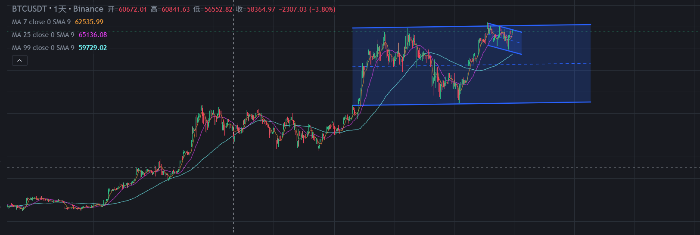
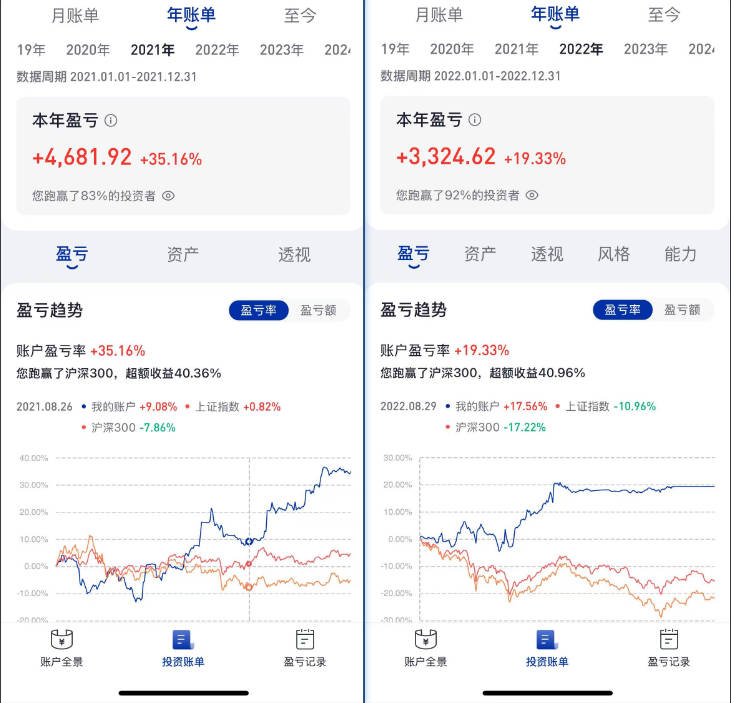
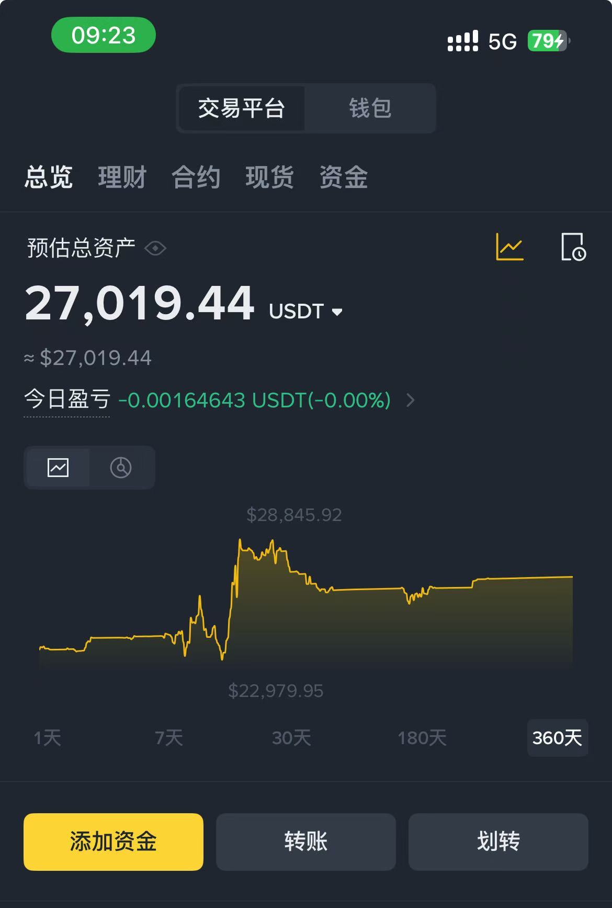

一、当下的行情
不关注四小时K线以下的微观波动。
为什么？
原因一：睡一觉起来，最多也就波动两根K线，不管是止损还是进场，不至于滑点特别大。
原因二：我还有本职工作在做，不能时时刻刻盯盘。

但是不管哪个周期的K线，其实运动的规律是相似的。
比如基本的旗形形态、震荡箱体、支撑阻力等，都是适用的。
当下的4小时K线。

首先，可以很直观地看到趋势已经运行了很长时间，从2023年年初一直到2025年年初。
到25年初以后开始了一段回调，而且回调比较深。

在回调之后没有突破新高，或者说突破了新高但不是有效突破。
我们不能教条地、静态地说点位突破了一点点就是实现了真正的突破。

根据客观的走势，我认为行情进入了宽幅的箱体震荡。
注意，我不是主观期望它进入震荡，也不是主观期望它站上新高，而是当前的客观事实告诉我，这大概率是震荡。
如果后期真的突破了趋势线，也突破了前方高点，我们再重新更正观点就行了。
跟随市场，而不是预测市场。

按照震荡的走势，那么接下来的交易计划就是等待到箱体下方。
如果快速到达下方，继续观望，因为接飞刀是很危险的，也就是直上直下的行情尽量不做。
如果慢慢下来，从时间要素来考虑，大概要等三个月左右。是个不错的做多背景。
如果配合有均线的支撑，就可关注具体的入场信号了。。

总之就是计划你的交易，交易你的计划。
如果市场走出新的形态，我们对应调整新的计划。

二、我在交易市场赚到10万元的过程
怎么开始的投资
大二还是大三的时候，大概2015年左右，恰逢A股的牛市，于是跑步入场，投入了大概一万元。
结局是没赚，但也没亏。可以说是初生牛犊不怕虎，运气好。

第一次在市场赚钱
再次回到交易市场是在2020年，那时已经开始工作了两年多，手里有点小小的积蓄。
于是在朋友的带动下，做起了A股的可转债。
可转债在当时有两个玩法。

一种是只打新，就是新债上市前去申购。
运气好的中签的话，可以以100元一张的价格认购。
中一签是10张，即1000元。
在这个债券上市的那天立刻抛售，通常情况下一签可以赚300到500元。破发的情况非常少。
第二种玩法是把债券当成股票一样在二级市场上交易，高卖低买。可转债有100元的下限，但上限也很高，并且是T+0的交易。
我的模式就是伏地魔，低点买入，耐心等待主力拉升。

我两种都参与了，投了2万元，打新一年赚了1000元，高卖低买赚了大概4000元。
算是初次尝到了投资的收益。

怎么加入B圈？怎么赚到了10万元？
接触B圈是同事有人在玩，推荐我开了个币安的账户，但一直也没有入金。
后来2021年，机缘巧合下，投简历面上了一家比较头部的交易所，岗位是风控系统后端开发。
这才正式加入了B圈。
当时每个月的薪资都是发U，但我只保留了四五千U在账户里，其他的基本上每个月都提出来。

快进到2023年，期间一直不赚不亏。
2023年，站在事后的角度来看，这轮轰轰烈烈的大牛市已经开始了。
但身在其中是不知道的，每个人都觉得牛市应该是2025年甚至2026年才会来。

当时我的想法也很单纯，2023年已经是加息的末尾，美联储马上要开启降息周期了。
降息就一定对应着放水和上涨。（当时持有这样朴素的观点，这个观点不全对，后续可以再分享加息降息的具体逻辑）
于是，在2023年6月份左右，入金了七万左右RMB。
当时的心理就是，死捏，捏到2025、2026，不信不涨。

标的选了ETH，当时的价格是1600多，直觉上感觉能涨到五六千。
事后来看，牛市初期一定是BTC的收益率是最高的。

就这样，死捏，捏到了2024年初，来了一波主升浪，每天都在新高。
于是10万RMB基本上就翻倍了。

当时每天都在上涨，涨得我心里没有底，以至于每天都要思考到底什么时候下车。

最终靠着运气好，做了一个很明智的选择：
开始学习技术分析，开始建立自己的交易逻辑。

为什么说是明智的选择？因为凭运气赚的钱，一定会凭实力亏出去。
如果当时继续死捏ETH，那么到2024年的七八月份，资金一定会回撤到14万左右。
从10万到20万很开心，但从20万到14万一定是非常非常痛苦的过程。
凭当时的认知，好的结局可能是认栽离场，坏的结局甚至是不服输，继续冲，最后把本金都搭进去。

很幸运，学了点技术分析，ETH的最高点那天，离场了。
到现在为止利润没有经过大的回撤，很开心。

接下来的计划
继续长期跟踪并押注B圈。
可以说，股市、B圈是当代年轻人为数不多的实现阶级跃迁的途径。
所以要继续认真学习技术分析，实践技术分析，不断完善交易系统。
很感谢一位领路人，带我了解什么是交易，带我入门技术分析的道路。
就是@罗晟，油管上可以看到他关于交易的教学。

心态上承认自己是个普通人。
什么是普通人？
放弃一年五倍、十倍的想法。
在小资金的时候，有些人喜欢做高风险的操作。
即使是高风险，翻了几倍，本金还是很少。
但为了翻倍所要付出的时间和精力，我觉得有点得不偿失。
所以，要从B圈之外的场景赚钱补充本金。
稳扎稳打，比如一年或者两年之后，当B圈又来到了低估期，如果到时候攒够了50万交易的资金，就全部打进去。
下一轮，一定会比这一轮做得好。

------------------------------
下面是一段自我介绍。
话说出门在外，身份都是自己给的。
所以在这里，我的身份很牛逼。
我要给
自己贴一个重要的标签，是啥呢？自媒体路上的小学生。
我，希望能早日有100个粉丝。向您鞠躬！
第二标签是，菜鸡币圈交易员，我有3万刀的资金量，擅长技术分析，我立志做比特币、币圈的科普者。
第三标签，也就是我在职场的角色，是一名程序猿。
我待过外企、币圈交易所，现任某云计算厂商工程师。
为什么程序猿要排在第三？
因为前两个是目标，第三个是手段。
打工是为了自由。
在这里，我打算成为最勤奋、最用心、最全力以赴的那个人。
感兴趣探讨的朋友，可以加杰登的私人微信：Jia_note
ps：多个知名交易博主的付费会员消息被聚合到我的消息群中。