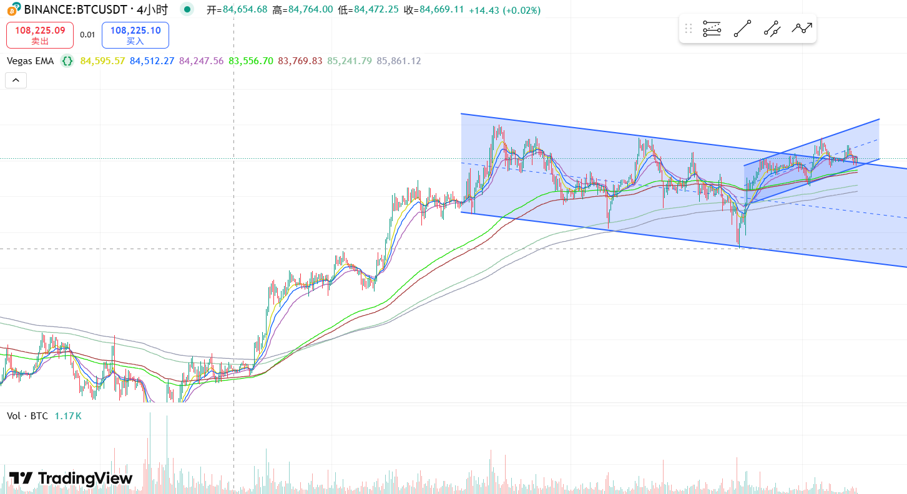
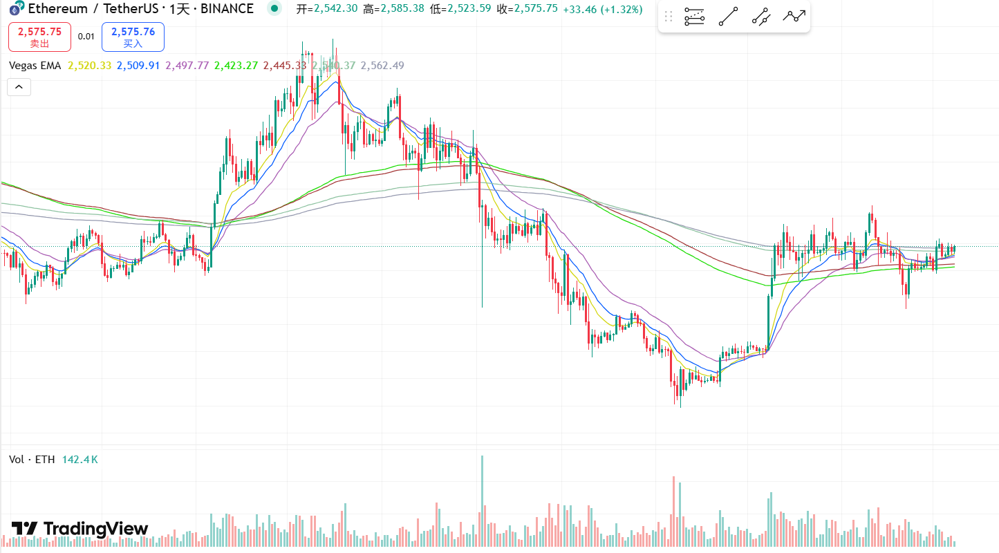
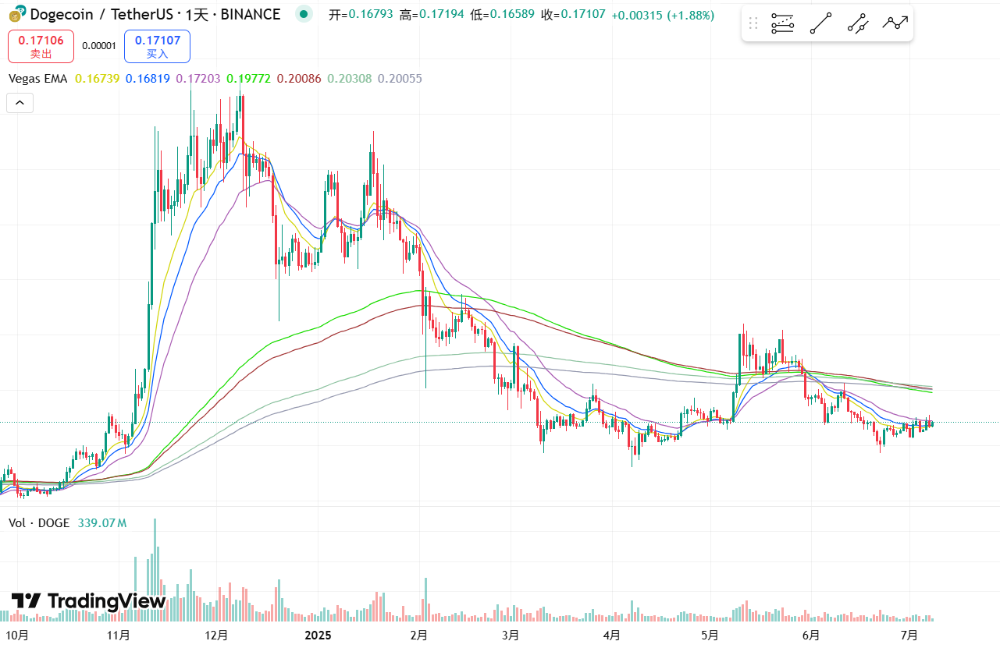
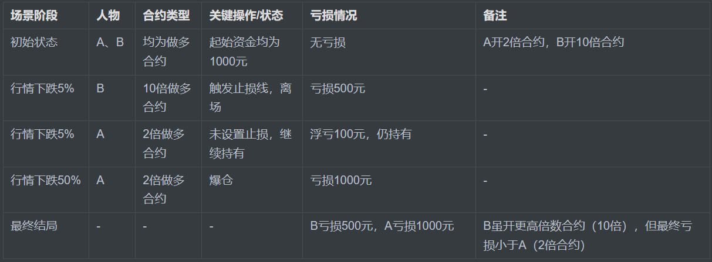
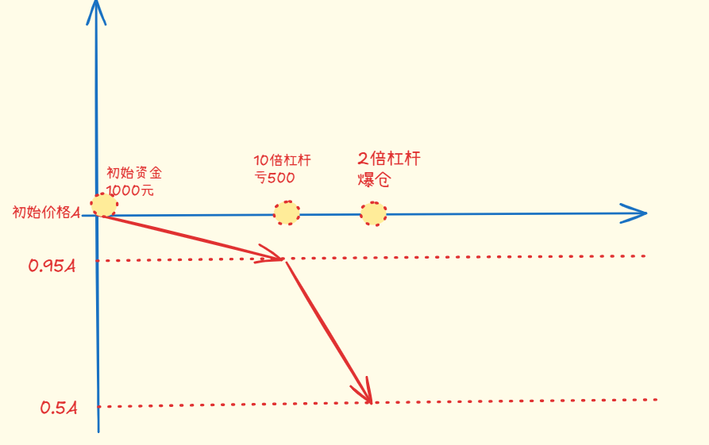
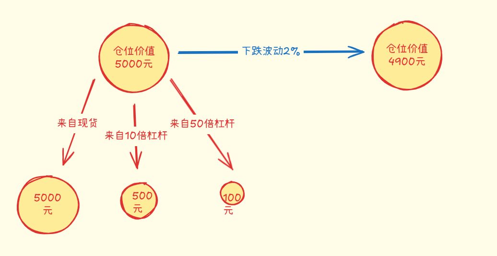

一、行情分析

BTC如上图。可以看到整体走的还是非常强势，四小时上看到一个回撤，但是立马又拉回来。
仍然在通道上沿磨来磨去，此处不认为是有效突破。
依然耐心等待K线的收敛，收敛的末端就是市场选择方向的时候，如果强势突破前方高点，才能算作入场信号。

ETH、DOGE如上图。整体走势很弱，没有做多背景，不必分析。

二、100倍杠杆高风险？2倍杠杆风险小？
来思考一个问题，究竟是100倍杠杆的风险高还是10倍杠杆的风险高？
在很多人朴素的认知中，肯定是100倍杠杆的风险高。
为什么？100倍杠杆，行情波动百分之一就会爆仓，如果考虑手续费和维持保证金的机制，实操中不到百分之一的波动就会爆仓。
这个说法是事实吗？
确实是。

但我们换一个视角来思考这个问题，设想一个场景。

例如起始资金都是1000元。
B开了10倍做多杠杆。
A开了2倍做多杠杆。

当行情下跌5%，此时触碰到B的止损线，B离场了。此时，B亏损了500元。
A没有设置止损线，继续持有。
当行情继续下跌，与开仓价格相比，当行情下跌了50%，此时A爆仓了。

我们来计算一下两个人最终的结局。
对比一下结果，B亏损了500，A亏损了1000。
B开了10倍杠杆，但是最终的亏损小于开了2倍杠杆的亏损。

思考一下为什么？

关键变量就是在什么位置止损。以及到达止损位置时，当前的仓位亏了多少钱。
所以要重新定义一下，我们在说100倍风险高，10倍风险小时，究竟什么是风险？
答：风险就是当达到止损线时，愿意承担的损失是多少。也可以说，风险是我们开出的仓位价值的大小结合止损线的宽度。

此时，我们得出第一个重要结论。
交易中要引入一个重要的变量，就是止损线。

止损线和是否使用杠杆无关，现货交易中也必须设置止损线。
只是现货通常来说持仓周期长一点，止损范围就设置的宽一点。
杠杆交易的持仓周期短一点，止损宽度就设置的窄一点。

明白了开仓一定要有止损线后，现在得出我们本文的最终结论。
什么是凯利公式，怎么计算以损定仓？
原理如下：
开仓前想好本次最多要输掉的筹码是多少，以及行情波动多少比例时会输掉全部的筹码。
例如打算下注100元，并且希望行情波动2%时就进行止损，这时最多也就输掉了100元。
那么开出的仓位价值的计算过程就是下注金额除以波动比例，就是5000元（100÷2%）。
这5000元可以完全用现货开仓5000元，也可以500元保证金开10倍杠杆，也可以100元保证金开50倍杠杆。
不管多少倍的杠杆，只要行情是波动了2%，那么最多也就输100元。

有人问：上述场景中能不能50元保证金开100倍杠杆？
不能，因为你在开仓前下注时，打算最多输掉100元，你只拿出来50元怎么可能下注100元？

所以，杠杆的倍数不是问题，10倍，50倍，100倍，无所谓，关键是愿意下注的数量，以及止损的位置。
杠杆只是提高了资金的利用率，杠杆本身并没有增大任何风险。

那么，单次下注下多少，下注后的止损放在什么位置？
关于单次下注的金额，海龟交易法中的提倡的方法是每次下注所有仓位的2%。那么净输50次才会把本金全部输光。
止损放在什么位置，什么样的结构形态值得下注，以及下注后的盈亏比问题，这是新的话题，需要再开新的篇章继续深入讨论。
本次，我们的核心知识就是以损定仓，100倍杠杆不可怕。
