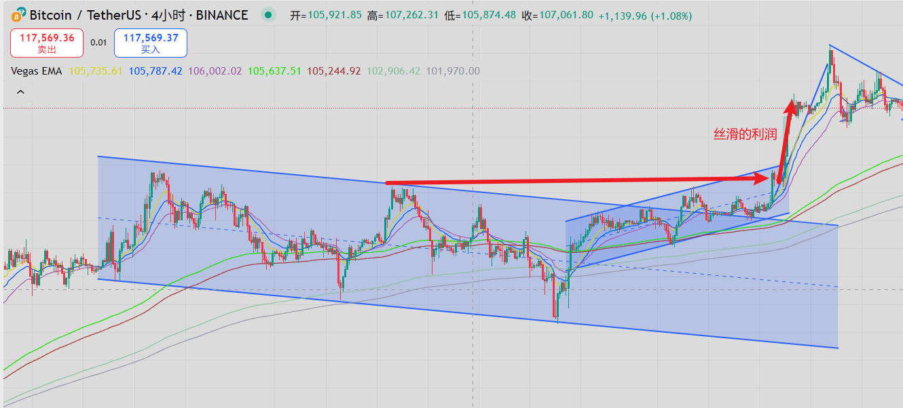
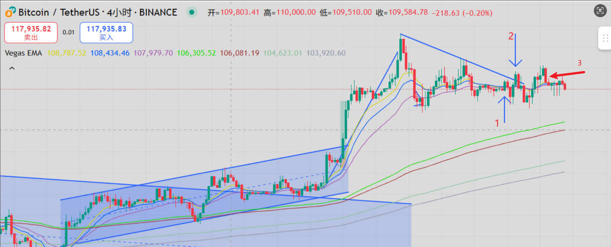
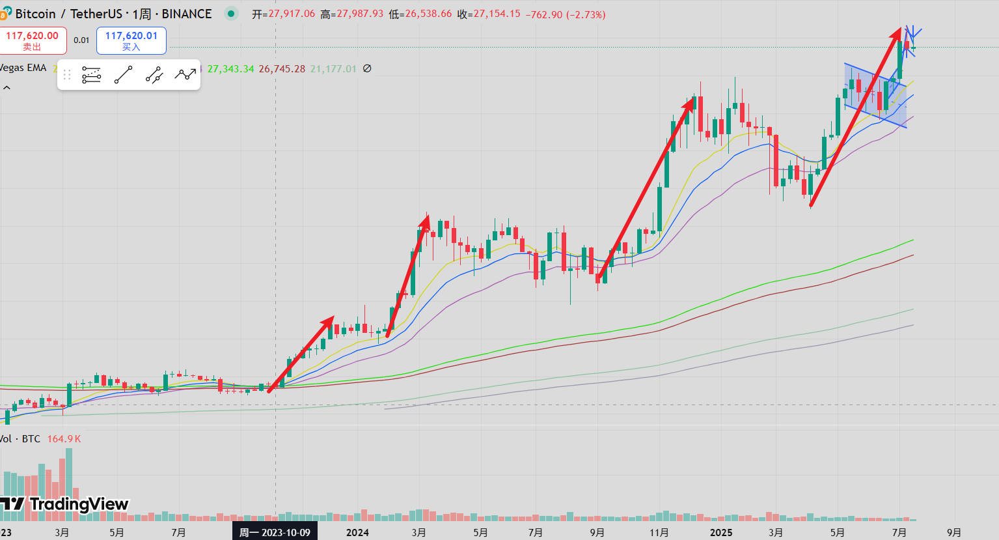
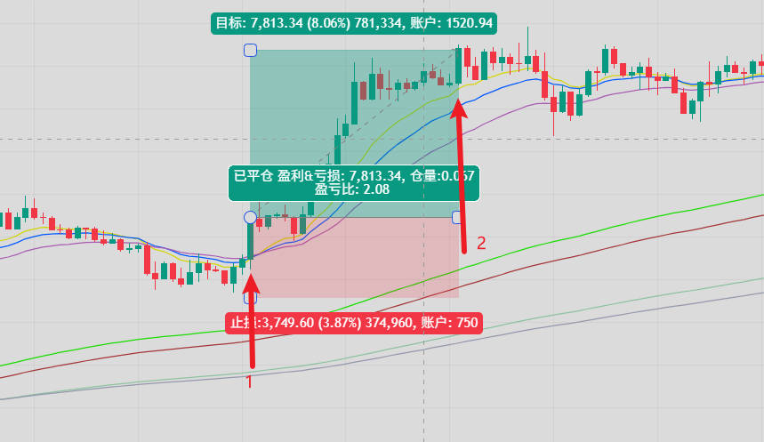
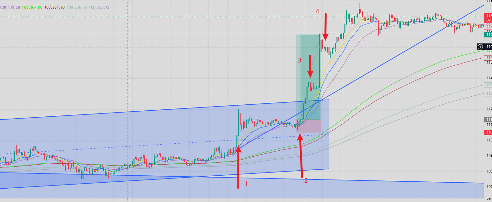
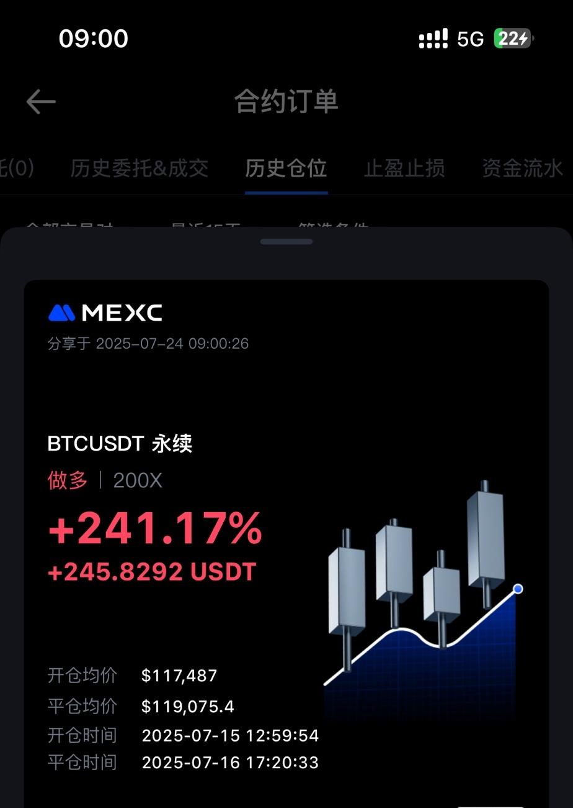
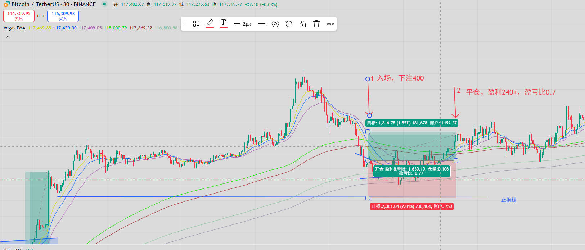

行情分析&搞懂盈亏比和胜率

一、行情分析
1.比特币行情：

前情提要，上期说到，如果突破趋势线，突破前方高点，可以追进去。
如图，立马追进去，不到24小时就收获利润了。很丝滑。

当下4小时走势

4小时短线上，出现一个很好的开仓的位置，如图中的1号箭头或2号箭头都是很好入场位置。
我自己是在2好箭头的位置，突破趋势线，突破的前方高点入场了。
是我惯用的入场信号。
但是开单后立马出现突破失败，差一点被打止损。
继续持仓等待，因为日线走势还在。可以再给一次冲高的机会。
如果还没有走出来，就可以离场了。

果然又一次突破失败了。最后在3号箭头的位置保本离场了。
该涨不涨就是弱，该跌不跌就是强。
这种行情是发散走势，持仓过程很煎熬，很容易被打止损。

所以不管4小时还是日线，等待行情继续收敛。
日线上的调整形态还是非常不错的。可以期待一个一比一的等距。

周线周线还是保持之前的看法，四段强势拉升，很可能已经走到动力不足。
但不意味着要做空。只是说大仓位做多的盈亏比不高。
趋势运行的很久了。是一个需要谨慎的位置。控制好下注的仓位。
保住前期的利润不回吐。

2.以太坊行情：

很强，超出预期。
第一第二段拉升，错过也是理所当然。
因为调整的时间还不够充分。我们不会左侧去抄底。
一个交易系统不能抓住所有的行情，出现踏空是必然现象。
只要按照系统来交易就是对的，抄底不是我们系统内的做法。

交易是长期的事情，如果我们这次重仓抄底蒙对了，那下次抄底失败怎么办？
把系统内的交易机会抓住，就已经能拿到非常丰厚的利润了。
所以，完全不需要fomo。

第三段拉升，其实是很容易抓到的。
突破的趋势线突破前方高点。直接追进去。
只是我在同一时间去做多比特币了。也是收获了三倍的利润。
后续可以出一个复盘的视频。

当前的位置，不适合追高了。
不管日线，还是4小时线，都要等待一个调整的结构出来。
当再次突破回调的上边沿。

二、搞懂盈亏比和胜率
前一篇文章，讨论了一下什么是以损定仓。
这次顺着上一篇的思路，继续讨论一下止损、止盈和胜率的关系。
上一篇文章的回顾地址:
https://mp.weixin.qq.com/s/c3BGnguWDOkd81Uv_Vsqiw
https://www.bilibili.com/video/BV1KPG5zcEak/

下面开始这次的交易课堂：搞懂盈亏比和胜率
1.什么是盈亏比？
有了以损定仓的思维后，我们每次下单前都会确定一个本次下注的金额。
例如是R。
那么对应的，如果行情走的与预期相反。止损后，最多输掉R的本金。
如果行情走的与预期相同，就把盈利的金额除以R，就可以得到盈亏比的值。

例如上图中的的形态，在1号箭头处下单，潜在的亏损是一个R，在2号箭头处平仓赚了两个R，我们就说盈亏比是2R：1R，即盈亏比是2。

2.盈亏比和胜率的关系？
通常来说，盈亏比与胜率是相矛盾的两个目标。
我们肯定希望盈亏比越大越好，因为当潜在损失相同的情况下，盈利肯定越多越好。
但是，预期的盈亏比过大时，对应的胜率肯定会下降。因为行情超一个方向运动的越远，希望下车甚至做相反方向的人就越多。
所以，市场上高胜率高盈亏比的机会是少的。
一定要耐心等待。

3.应该做高盈亏比低胜率还是低盈亏比高胜率的交易？
先说结论，如果追求暴富那么就选高盈亏比的方式。
知名的交易明星，例如肥宅、比特皇他们，都是在趋势发起时，选则很窄的止损范围，借着趋势的力量，一波赚到几十倍的收益。
但缺点就是可能会频繁的止损。有时候会很打击交易的心态。

如果是新手，正在学习中。
或者喜欢用长时间慢慢积累利润，那么就选低盈亏比高胜率。
因为胜率高，可以经常止盈，提高交易信心。
缺点是，可能要频繁开单，频繁开单也是不好的，会关注过多细节，而错过大的利润。

所以，如果真的想要赚取更多的利润，要不断追求高盈亏比的交易方式。

4.下面给出一个胜率相对较高，盈亏比也很高的策略。
口诀：大周期的1比1等距中寻找小周期的机会。
具体的入场信号：趋势行情+强势的回调+回调末期出现反转K线。
例如2025年7月10日21点30分，可以看下30分钟周期。

前面出现了强势的拉升，在1号箭头处出现了4小时周期突破趋势线也突破了前方高点。
可以看一个4小时的一比一等距。
然后切到30分钟的k线，拉升后第一次开始收敛，并在收敛末端疑似出现了向下的假突破。
那么在2号K处就是做高盈亏比的入场信号。
这时，配合上大周期的突破k有一比一的等距的预期，可以做到6到7的盈亏比。

5.防骗小指南，在看到kol晒他的收益率有多少倍的时候，其实这个指标是没啥用的。

举个例子。

看上图盈利百分之两百多，很牛逼吧。
其实这个交易的盈亏不算高，也就是说是不那么划算。

下面具体分析一下。

【比特币30分钟图标、画出来入场位置，入场金额、预期止损止盈位置、真实止盈位置、真实盈亏比】

如上图，1号箭头是建仓的位置，下注的金额R是400U。
开仓价格117487，止损价格是115050，预期的盈亏比是1，即价格到达119924时可以有1R的利润。
实际价格运行过程中，在2号箭头处平仓了，价格是119075，盈利245U，真实的盈亏比大概只有0.6。

看起来有240%的利润，是因为开了200倍的全仓合约，保证金只有100U。
如果用400倍全仓合约，保证金只需要50U，同样的利润，收益率看起来可以达到480%。
所以，合约交易中收益率看起来挺唬人，其实没啥用。

因为开单后，真实的盈亏比只有开单的人自己知道。
可能看起来是赚了700%，但是真实的盈亏比可能连1：1都没有到。
