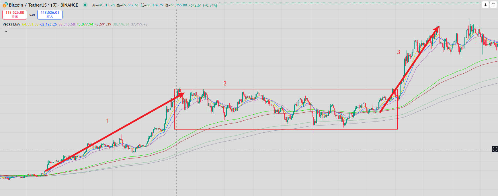
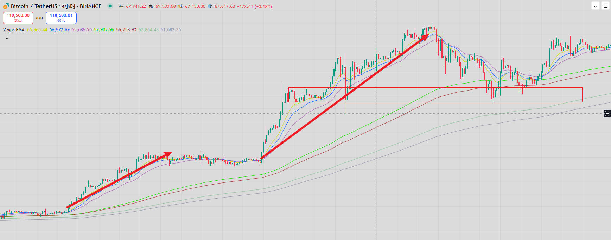
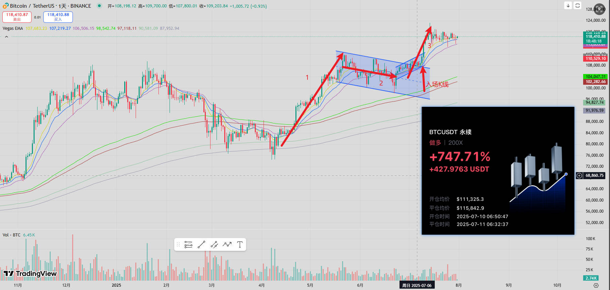
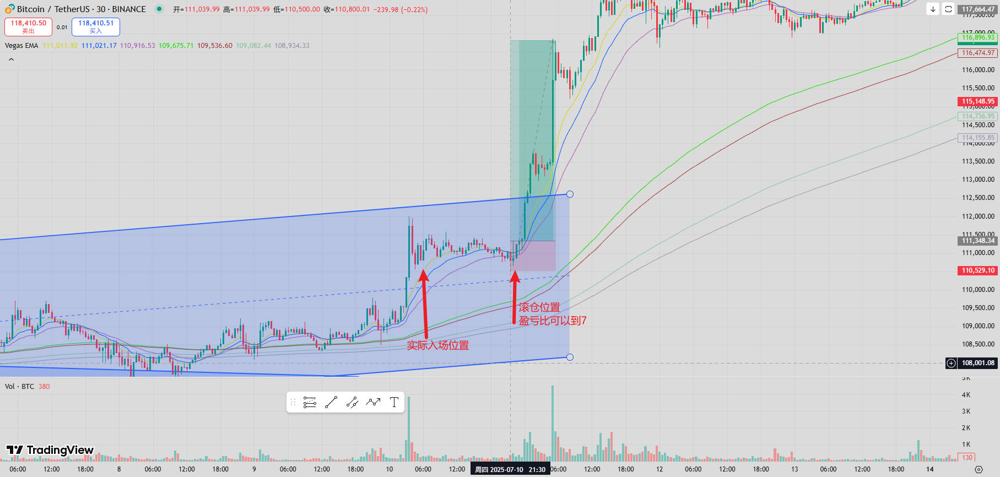
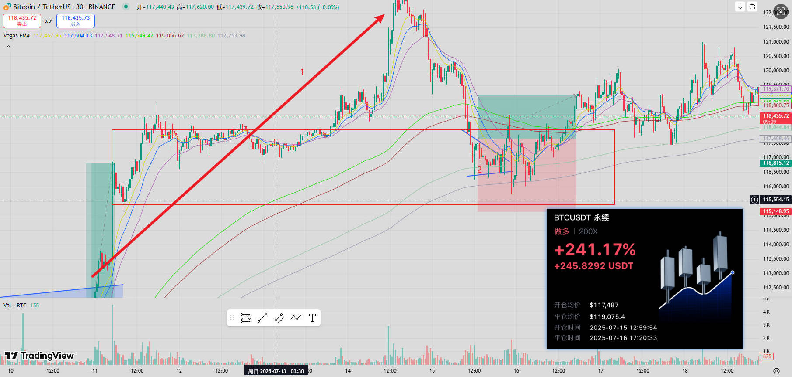
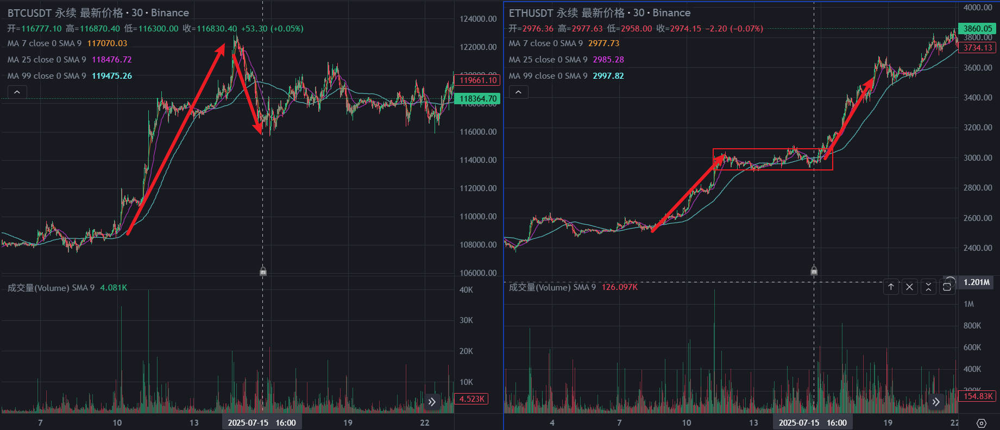

25-8-7 10天3倍，实战复盘

这一期复盘一下七月中旬那一波拉升中的实战操作。
主要是300U到1200U的过程中利润最大的两笔单子。

一、交易系统介绍
先简单介绍一下我自己的交易系统，也就是我的做单风格。

总体来说，我一般做两种类型的行情。
第一、趋势+调整+一比一等距。占比百分之70。
第二、趋势+关键位置抄底。占比百分之30。
这两种都是比较右侧的交易方式。

1.解释一下趋势+调整+一比一等距

如上图，趋势发起后，不会立马结束，往往迎来调整。
若回调形态也很坚挺，例如比较窄幅的横盘，或者窄幅的牛旗回调。
那么，大概率会延续一段一比一等距的拉升。

内在逻辑是，贪婪往往会延续，趋势已经发起，如果调整形态走得好，说明市场的买盘足够坚挺，可以期待下一段趋势。

2.解释一下趋势行情后的抄底。

如上图，抄底一般用到vegas通道。即，ema144、169、288、288的均线，当趋势发起后，不会立马反转，通常都要对高点再次进行测试。
当价格打到vegas通道时，并且前方有支撑平台时，往往是一个不错的抄底位置。
这个方法抄底其实用在周线，去重仓抄底比特币是最好用的。
但是为了训练这种方式的敏感度，我也会在小周期，例如4小时K线偶尔进行训练。

小结：
右侧的好处就是不预测市场，只跟随市场，有了系统的形态和信号，才认为行情来了，立马追就行。
有行情就做，没行情就等。

我最喜欢的方式是做趋势回调后的一比一等距。因为入场简单，止盈简单，胜率也相对较高。
最关键的是可以在一比一等距中压缩止损空间，放大盈亏比，盈利的上限也很高。
抄底的方式只会在大周期上进行重仓，例如周线的vegas，平时偶尔会抄底进行手感训练。

二、10天3倍，实战复盘
第一笔，7-11做多btc

如上图，利润最大的一笔，大概赚了450U。用的做单方式是趋势回调后的一比一等距。
时间周期：4小时，因为日常盯盘的周期就是4小时。
入场逻辑：上涨的趋势背景 + 窄幅回调区间 + 足够的时间要素 + 信号（突破趋势线 + 突破前方高点）。
预期止损止盈位置，止损：前方低点。止盈：通道中的一比一等距。
实际结果：btc入场后24小时，达到一比一预期，直接离场，真实盈亏比在1.5。没有抓到剩余的涨幅，但是也很可以了，不可能赚到所有的利润。物极必反。

可优化的点：

如上图，在北京时间7月10日21点左右。
出现了一个绝佳的可以滚仓的高盈亏比的位置。

时间周期：前方已经出现了4小时周期的突破，可以预测大周期上的一比一等距。如果想要做高盈亏比的交易，就要去关注微观细节。
看15分钟、30分钟、1小时K线都可以。
入场逻辑：上涨的趋势背景 + 窄幅回调区间 + 足够的时间要素 + 信号（区间下沿出现急跌急涨的假跌破）。
事后看，这笔交易的盈亏比可以做到6左右。相当不错。

第二笔，7-15做多btc
利润排第二的一笔，大概赚了250U。用的做单方式是趋势后的首次抄底。

如上图，这个单子，虽然是盈利的，但是可以反思的东西还是很多的。

第一，在打到vegas通道并反弹时入场了。这个入场信号不好。
本质还是怕入场晚了。没有经过时间要素的加持。
以后一定要等vegas的结构出来之后再入场，起码也要等第二个高点之后再入场。
太着急入场，持仓体验非常不好。

如果因为等一等，而错过了V型反弹这种走势，那么说明这个形态不是系统内的交易，放过自己。也不必fomo。

第二，即使是在做多，也要选择一个更好的标的。

如上图，对比同期的以太坊走势，其实以太坊的做多形态是更好的。
以太坊没有出现冲高回落。
以太坊的形态更加符合趋势+完美的横盘回调，可以预期一比一等距，而不是抄底。
如果选择的是做多eth，那么这笔盈亏比可以做到2或者3。

如何选择一个更值得做的标的，也是有很多的讲究。
我自己做的也不好，以后继续学习。
有了新的感悟，继续跟大家分享。

散会。